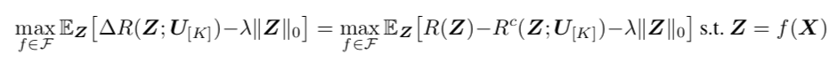
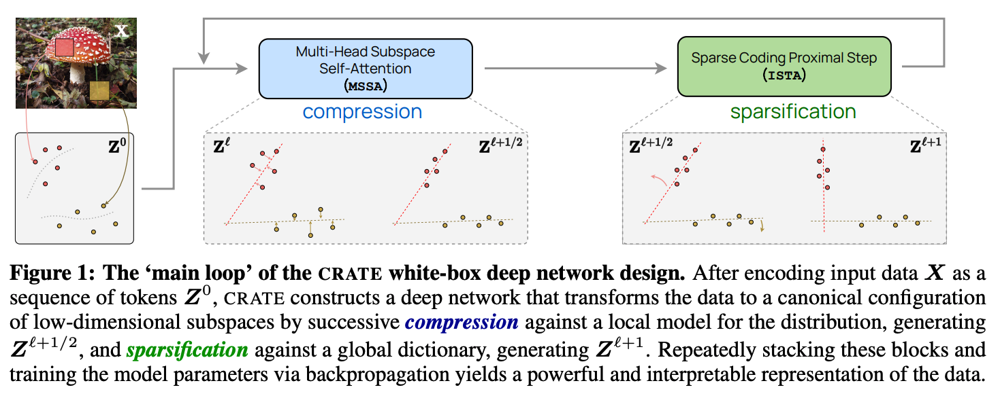
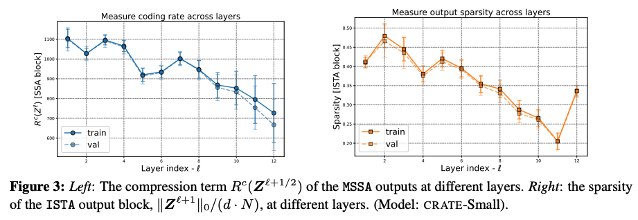
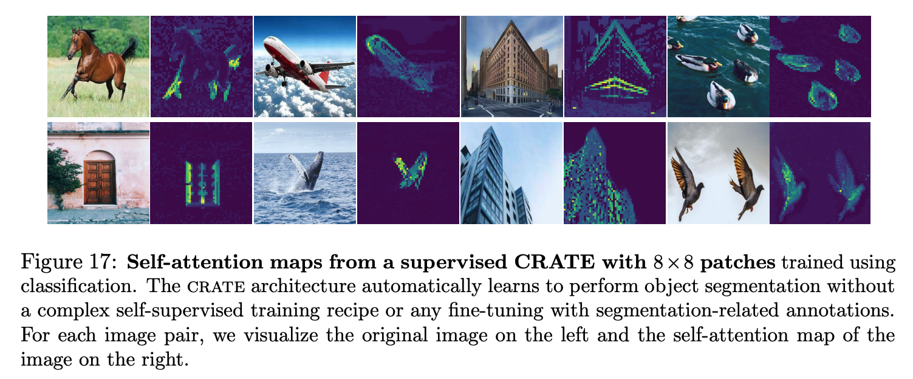
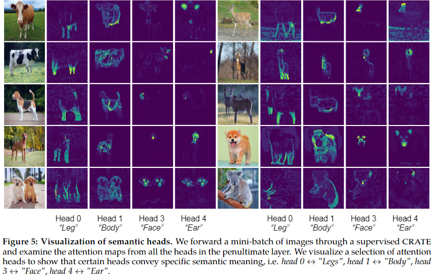

# CRATE (Coding RAte reduction TransformEr)
This repository is the official PyTorch implementation of the papers: 

- **White-Box Transformers via Sparse Rate Reduction** [**NeurIPS-2023**, [paper link](https://arxiv.org/abs/2306.01129)]. By [Yaodong Yu](https://yaodongyu.github.io) (UC Berkeley), [Sam Buchanan](https://sdbuchanan.com) (TTIC), [Druv Pai](https://druvpai.github.io) (UC Berkeley), [Tianzhe Chu](https://tianzhechu.com/) (UC Berkeley), [Ziyang Wu](https://robinwu218.github.io/) (UC Berkeley), [Shengbang Tong](https://tsb0601.github.io/petertongsb/) (UC Berkeley), [Benjamin D Haeffele](https://www.cis.jhu.edu/~haeffele/#about) (Johns Hopkins University), and [Yi Ma](http://people.eecs.berkeley.edu/~yima/) (UC Berkeley). 
- **Emergence of Segmentation with Minimalistic White-Box Transformers** [[paper link](https://arxiv.org/abs/2308.16271)]. By [Yaodong Yu](https://yaodongyu.github.io)* (UC Berkeley),  [Tianzhe Chu](https://tianzhechu.com/)* (UC Berkeley & ShanghaiTech U), [Shengbang Tong](https://tsb0601.github.io/petertongsb/) (UC Berkeley & NYU), [Ziyang Wu](https://robinwu218.github.io/) (UC Berkeley),  [Druv Pai](https://druvpai.github.io) (UC Berkeley),  [Sam Buchanan](https://sdbuchanan.com) (TTIC), and [Yi Ma](http://people.eecs.berkeley.edu/~yima/) (UC Berkeley & HKU). 2023. (* equal contribution)

## What is CRATE?
CRATE (Coding RAte reduction TransformEr) is a white-box (mathematically interpretable) transformer architecture, where each layer performs a single step of an alternating minimization algorithm to optimize the **sparse rate reduction objective**
 <p align="center">
    
</p>
<p align="center">

where the $\ell^{0}$-norm promotes the sparsity of the final token representations $\mathbf{Z} = f(\mathbf{X})$. The function $f$ is defined as 
$$f=f^{L} \circ f^{L-1} \circ \cdots \circ f^{1} \circ f^{0},$$
$f^0$ is the pre-processing mapping, and $f^{\ell}$ is the $\ell$-th layer forward mapping that transforms the token distribution to optimize the above sparse rate reduction objective incrementally. More specifically, $f^{\ell}$ transforms the $\ell$-th layer token representations $\mathbf{Z}^{\ell}$ to  $\mathbf{Z}^{\ell+1}$ via the $\texttt{MSSA}$ (Multi-Head Subspace Self-Attention) block and the $\texttt{ISTA}$ (Iterative Shrinkage-Thresholding Algorithms) block, i.e.,
$$\mathbf{Z}^{\ell+1} = f^{\ell}(\mathbf{Z}^{\ell}) = \texttt{ISTA}(\mathbf{Z}^{\ell} + \texttt{MSSA}(\mathbf{Z}^{\ell})).$$

### 1. CRATE Architecture overview

Figure 1 presents an overview of the pipeline for our proposed **CRATE** architecture:

<p align="center">
    
</p>
<p align="center">

### 2. One layer/block of CRATE

Figure 2 shows the overall architecture of one block of **CRATE**:

<p align="center">
    
</p>
<p align="center">

### 3. Per-layer optimization in CRATE

In Figure 3, we measure the compression term [ $R^{c}$ ($\mathbf{Z}^{\ell+1/2}$) ] and the sparsity term [ $||\mathbf{Z}^{\ell+1}||_0$ ] defined in the **sparse rate reduction objective**, and we find that each layer of **CRATE** indeed optimizes the targeted objectives:
<p align="center">
    
</p>
<p align="center">

### 4. Segmentation visualization of CRATE
In Figure 4, we visualize self-attention maps from a supervised **CRATE** with 8x8 patches (similar to the ones shown in [DINO](https://github.com/facebookresearch/dino) :t-rex:):
<p align="center">
    
</p>
<p align="center">


## Construct a CRATE model
A CRATE model can be defined using the following code, (the below parameters are specified for CRATE-Tiny)
```python
from model.crate import CRATE
dim = 384
n_heads = 6
depth = 12
model = CRATE(image_size=224,
              patch_size=16,
              num_classes=1000,
              dim=dim,
              depth=depth,
              heads=n_heads,
              dim_head=dim // n_heads)
```

### Pre-trained Checkpoints (ImageNet-1K)
| model | `dim` | `n_heads` | `depth` | pre-trained checkpoint |
| -------- | -------- | -------- | -------- | -------- | 
| **CRATE-T**(iny)    | 384   | 6   | 12 | TODO | 
| **CRATE-S**(mall)    | 576   | 12   | 12 | [download link](https://drive.google.com/file/d/1hYgDJl4EKHYfKprwhEjmWmWHuxnK6_h8/view?usp=share_link) | 
| **CRATE-B**(ase)    | 768   | 12   | 12 | TODO | 
| **CRATE-L**(arge) | 1024 | 16 | 24 | TODO | 

## Training CRATE on ImageNet
To train a CRATE model on ImageNet-1K, run the following script (training CRATE-tiny)

As an example, we use the following command for training CRATE-tiny on ImageNet-1K:
```python
python main.py 
  --arch CRATE_tiny 
  --batch-size 512 
  --epochs 200 
  --optimizer Lion 
  --lr 0.0002 
  --weight-decay 0.05 
  --print-freq 25 
  --data DATA_DIR
```
and replace `DATA_DIR` with `[imagenet-folder with train and val folders]`.


## Finetuning pretrained / training random initialized CRATE on CIFAR10

```python
python finetune.py 
  --bs 256 
  --net CRATE_tiny 
  --opt adamW  
  --lr 5e-5 
  --n_epochs 200 
  --randomaug 1 
  --data cifar10 
  --ckpt_dir CKPT_DIR 
  --data_dir DATA_DIR
```
Replace `CKPT_DIR` with the path for the pretrained CRATE weight, and replace `DATA_DIR` with the path for the `CIFAR10` dataset. If `CKPT_DIR` is `None`, then this script is for training CRATE from random initialization on CIFAR10.

## Demo for the segmentations

We provide a Colab Jupyter notebook to visualize the emerged segmentations from a supervised **CRATE**. The demo provides visualizations for Figure 4 and Figure 5.

Link: [crate-emergence.ipynb](https://colab.research.google.com/drive/1rYn_NlepyW7Fu5LDliyBDmFZylHco7ss?usp=sharing) (in colab)

<p align="center">
    
</p>
<p align="center">


## Reference
For technical details and full experimental results, please check the [crate paper](https://arxiv.org/abs/2306.01129) and [crate segmentation paper](https://arxiv.org/abs/2308.16271). Please consider citing our work if you find it helpful to yours:

```
@article{yu2023white,
  title={White-Box Transformers via Sparse Rate Reduction},
  author={Yu, Yaodong and Buchanan, Sam and Pai, Druv and Chu, Tianzhe and Wu, Ziyang and Tong, Shengbang and Haeffele, Benjamin D and Ma, Yi},
  journal={arXiv preprint arXiv:2306.01129},
  year={2023}
}
```
```
@article{yu2023emergence,
  title={Emergence of Segmentation with Minimalistic White-Box Transformers},
  author={Yu, Yaodong and Chu, Tianzhe and Tong, Shengbang and Wu, Ziyang and Pai, Druv and Buchanan, Sam and Ma, Yi},
  journal={arXiv preprint arXiv:2308.16271},
  year={2023}
}
```
