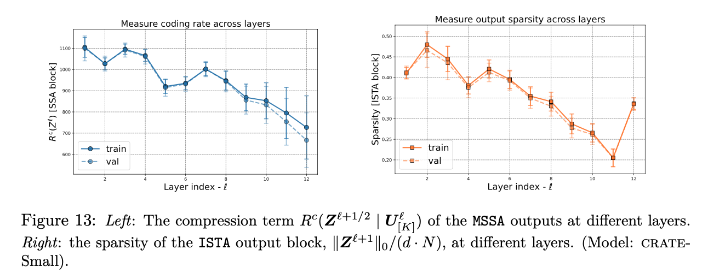
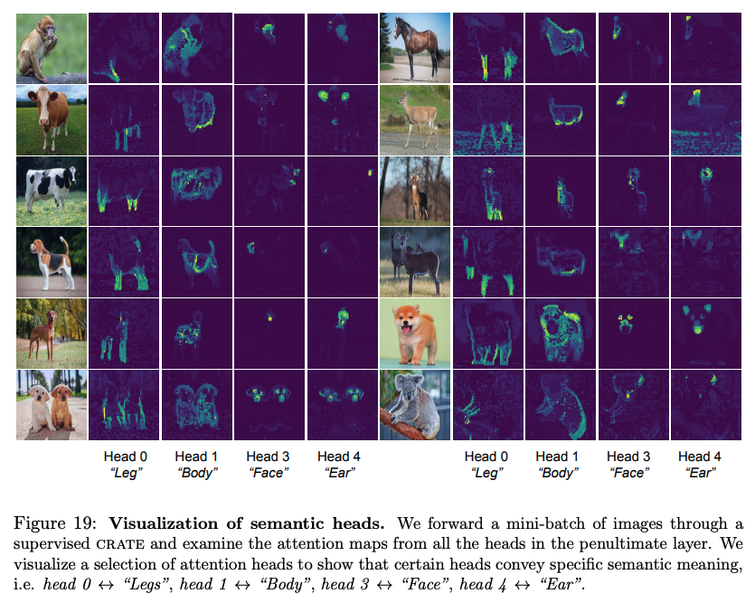
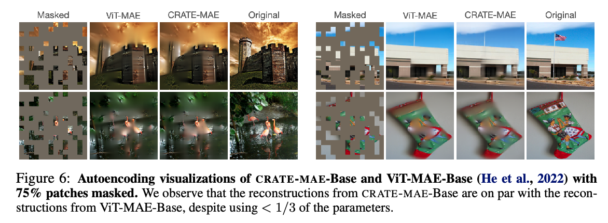

# CRATE (Coding RAte reduction TransformEr)
This repository is the official PyTorch implementation of the papers: 

- **White-Box Transformers via Sparse Rate Reduction** [**NeurIPS-2023**, [paper link](https://openreview.net/forum?id=THfl8hdVxH#)]. By [Yaodong Yu](https://yaodongyu.github.io) (UC Berkeley), [Sam Buchanan](https://sdbuchanan.com) (TTIC), [Druv Pai](https://druvpai.github.io) (UC Berkeley), [Tianzhe Chu](https://tianzhechu.com/) (UC Berkeley), [Ziyang Wu](https://robinwu218.github.io/) (UC Berkeley), [Shengbang Tong](https://tsb0601.github.io/petertongsb/) (UC Berkeley), [Benjamin D Haeffele](https://www.cis.jhu.edu/~haeffele/#about) (Johns Hopkins University), and [Yi Ma](http://people.eecs.berkeley.edu/~yima/) (UC Berkeley). 
- **Emergence of Segmentation with Minimalistic White-Box Transformers** [**CPAL-2024**, [paper link](https://arxiv.org/abs/2308.16271)]. By [Yaodong Yu](https://yaodongyu.github.io)* (UC Berkeley),  [Tianzhe Chu](https://tianzhechu.com/)* (UC Berkeley & ShanghaiTech U), [Shengbang Tong](https://tsb0601.github.io/petertongsb/) (UC Berkeley & NYU), [Ziyang Wu](https://robinwu218.github.io/) (UC Berkeley),  [Druv Pai](https://druvpai.github.io) (UC Berkeley),  [Sam Buchanan](https://sdbuchanan.com) (TTIC), and [Yi Ma](http://people.eecs.berkeley.edu/~yima/) (UC Berkeley & HKU). 2023. (* equal contribution)
- **Masked Autoencoding via Structured Diffusion with White-Box Transformers** [**ICLR-2024**, [paper link](https://openreview.net/forum?id=PvyOYleymy)]. By [Druv Pai](https://druvpai.github.io) (UC Berkeley), [Ziyang Wu](https://robinwu218.github.io/) (UC Berkeley), [Sam Buchanan](https://sdbuchanan.com), [Yaodong Yu](https://yaodongyu.github.io) (UC Berkeley), and [Yi Ma](http://people.eecs.berkeley.edu/~yima/) (UC Berkeley).

Also, we have released a larger journal-length overview paper of this line of research, which contains a superset of all the results presented above, and also more results in NLP and vision SSL.
- **White-Box Transformers via Sparse Rate Reduction: Compression is All There Is?** [[paper link](https://arxiv.org/abs/2311.13110)]. By [Yaodong Yu](https://yaodongyu.github.io) (UC Berkeley), [Sam Buchanan](https://sdbuchanan.com) (TTIC), [Druv Pai](https://druvpai.github.io) (UC Berkeley), [Tianzhe Chu](https://tianzhechu.com/) (UC Berkeley), [Ziyang Wu](https://robinwu218.github.io/) (UC Berkeley), [Shengbang Tong](https://tsb0601.github.io/petertongsb/) (UC Berkeley), [Hao Bai](https://www.jackgethome.com/) (UIUC), [Yuexiang Zhai](https://yx-s-z.github.io/) (UC Berkeley), [Benjamin D Haeffele](https://www.cis.jhu.edu/~haeffele/#about) (Johns Hopkins University), and [Yi Ma](http://people.eecs.berkeley.edu/~yima/) (UC Berkeley).


# Table of Contents

* [CRATE (Coding RAte reduction TransformEr)](#crate-coding-rate-reduction-transformer)
    * [Theoretical Background: What is CRATE?](#theoretical-background-what-is-crate)
      * [1. CRATE Architecture overview](#1-crate-architecture-overview)
      * [2. One layer/block of CRATE](#2-one-layerblock-of-crate)
      * [3. Per-layer optimization in CRATE](#3-per-layer-optimization-in-crate)
      * [4. Segmentation visualization of CRATE](#4-segmentation-visualization-of-crate)
   * [Autoencoding](#autoencoding)
* [Implementation and experiments](#implementation-and-experiments)
   * [Constructing a CRATE model](#constructing-a-crate-model)
      * [Pre-trained Checkpoints (ImageNet-1K)](#pre-trained-checkpoints-imagenet-1k)
   * [Training CRATE on ImageNet](#training-crate-on-imagenet)
   * [Finetuning pretrained / training random initialized CRATE on CIFAR10](#finetuning-pretrained--training-random-initialized-crate-on-cifar10)
   * [Demo: Emergent segmentation in CRATE](#demo-emergent-segmentation-in-crate)
   * [Constructing a CRATE autoencoding model](#constructing-a-crate-autoencoding-model)
      * [Pre-trained Checkpoints (ImageNet-1K)](#pre-trained-checkpoints-imagenet-1k-1)
   * [Training/Fine-Tuning CRATE-MAE](#trainingfine-tuning-crate-mae)
* [Reference](#reference)

## Theoretical Background: What is CRATE?
CRATE (Coding RAte reduction TransformEr) is a white-box (mathematically interpretable) transformer architecture, where each layer performs a single step of an alternating minimization algorithm to optimize the **sparse rate reduction objective**
 <p align="center">
    
</p>
<p align="center">

where $R$ and $R^{c}$ are different _coding rates_ for the input representations w.r.t.~different codebooks, and the $\ell^{0}$-norm promotes the sparsity of the final token representations $\boldsymbol{Z} = f(\boldsymbol{X})$. The function $f$ is defined as 
$$f=f^{L} \circ f^{L-1} \circ \cdots \circ f^{1} \circ f^{\mathrm{pre}},$$
where $f^{\mathrm{pre}}$ is the pre-processing mapping, and $f^{\ell}$ is the $\ell$-th layer forward mapping that transforms the token distribution to optimize the above sparse rate reduction objective incrementally. More specifically, $f^{\ell}$ transforms the $\ell$-th layer token representations $\boldsymbol{Z}^{\ell}$ to  $\boldsymbol{Z}^{\ell+1}$ via the $\texttt{MSSA}$ (Multi-Head Subspace Self-Attention) block and the $\texttt{ISTA}$ (Iterative Shrinkage-Thresholding Algorithms) block, i.e.,
$$\boldsymbol{Z}^{\ell+1} = f^{\ell}(\boldsymbol{Z}^{\ell}) = \texttt{ISTA}(\boldsymbol{Z}^{\ell} + \texttt{MSSA}(\boldsymbol{Z}^{\ell})).$$

### 1. CRATE Architecture overview

The following figure presents an overview of the pipeline for our proposed **CRATE** architecture:

<p align="center">
    
</p>
<p align="center">

### 2. One layer/block of CRATE

The following figure shows the overall architecture of one layer of **CRATE** as the composition of $\texttt{MSSA}$ and $\texttt{ISTA}$ blocks.

<p align="center">
    
</p>
<p align="center">

### 3. Per-layer optimization in CRATE

In the following figure, we measure the compression term [ $R^{c}$ ($\boldsymbol{Z}^{\ell+1/2}$) ] and the sparsity term [ $||\boldsymbol{Z}^{\ell+1}||_0$ ] defined in the **sparse rate reduction objective**, and we find that each layer of **CRATE** indeed optimizes the targeted objectives, showing that our white-box theoretical design is predictive of practice.
<p align="center">
    
</p>
<p align="center">

### 4. Segmentation visualization of CRATE
In the following figure, we visualize self-attention maps from a supervised **CRATE** model with 8x8 patches (similar to the ones shown in [DINO](https://github.com/facebookresearch/dino) :t-rex:).
<p align="center">
    
</p>
<p align="center">

We also discover a surprising empirical phenomenon where each attention head in **CRATE** retains its own semantics.
<p align="center">
    
</p>
<p align="center">


## Autoencoding

We can also use our theory to build a principled autoencoder, which has the following architecture.
<p align="center">
    
</p>
<p align="center">

It has many of the same empirical properties as the base **CRATE** model, such as segmented attention maps and amenability to layer-wise analysis. We train it on the masked autoencoding task (calling this model **CRATE-MAE**), and it achieves comparable performance in linear probing and reconstruction quality as the base ViT-MAE.

<p align="center">
    
</p>
<p align="center">


# Implementation and Experiments

## Constructing a CRATE model
A CRATE model can be defined using the following code, (the below parameters are specified for CRATE-Tiny)
```python
from model.crate import CRATE
dim = 384
n_heads = 6
depth = 12
model = CRATE(image_size=224,
              patch_size=16,
              num_classes=1000,
              dim=dim,
              depth=depth,
              heads=n_heads,
              dim_head=dim // n_heads)
```

### Pre-trained Checkpoints (ImageNet-1K)
| model | `dim` | `n_heads` | `depth` | pre-trained checkpoint |
| -------- | -------- | -------- | -------- | -------- | 
| **CRATE-T**(iny)    | 384   | 6   | 12 | TODO | 
| **CRATE-S**(mall)    | 576   | 12   | 12 | [download link](https://drive.google.com/file/d/1hYgDJl4EKHYfKprwhEjmWmWHuxnK6_h8/view?usp=share_link) | 
| **CRATE-B**(ase)    | 768   | 12   | 12 | TODO | 
| **CRATE-L**(arge) | 1024 | 16 | 24 | TODO | 

## Training CRATE on ImageNet
To train a CRATE model on ImageNet-1K, run the following script (training CRATE-tiny)

As an example, we use the following command for training CRATE-tiny on ImageNet-1K:
```python
python main.py 
  --arch CRATE_tiny 
  --batch-size 512 
  --epochs 200 
  --optimizer Lion 
  --lr 0.0002 
  --weight-decay 0.05 
  --print-freq 25 
  --data DATA_DIR
```
and replace `DATA_DIR` with `[imagenet-folder with train and val folders]`.


## Finetuning pretrained / training random initialized CRATE on CIFAR10

```python
python finetune.py 
  --bs 256 
  --net CRATE_tiny 
  --opt adamW  
  --lr 5e-5 
  --n_epochs 200 
  --randomaug 1 
  --data cifar10 
  --ckpt_dir CKPT_DIR 
  --data_dir DATA_DIR
```
Replace `CKPT_DIR` with the path for the pretrained CRATE weight, and replace `DATA_DIR` with the path for the `CIFAR10` dataset. If `CKPT_DIR` is `None`, then this script is for training CRATE from random initialization on CIFAR10.

## Demo: Emergent segmentation in CRATE

CRATE models exhibit emergent segmentation in their self-attention maps solely through supervised training.
We provide a Colab Jupyter notebook to visualize the emerged segmentations from a supervised **CRATE** model. The demo provides visualizations which match the segmentation figures above.

Link: [crate-emergence.ipynb](https://colab.research.google.com/drive/1rYn_NlepyW7Fu5LDliyBDmFZylHco7ss?usp=sharing) (in colab)

<p align="center">
    
</p>
<p align="center">

## Constructing a CRATE autoencoding model
A CRATE-autoencoding model (specifically **CRATE-MAE-Base**) can be defined using the following code:
```python
from model.crate_ae.crate_ae import mae_crate_base
model = mae_crate_base()
```
The other sizes in the paper are also importable in that way. Modifying the `model/crate_ae/crate_ae.py` file will let you initialize and serve your own config.

### Pre-trained Checkpoints (ImageNet-1K)
| model | `dim` | `n_heads` | `depth` | pre-trained checkpoint |
| -------- | -------- | -------- | -------- | -------- | 
| **CRATE-MAE-S**(mall)    | 576   | 12   | 12 | TODO | 
| **CRATE-MAE-B**(ase)    | 768   | 12   | 12 | [link](https://drive.google.com/file/d/11i5BMwymqOsunq44WD3omN5mS6ZREQPO/view?usp=sharing) | 

## Training/Fine-Tuning CRATE-MAE
To train or fine-tune a CRATE-MAE model on ImageNet-1K, please refer to the [codebase on MAE training](https://github.com/facebookresearch/mae) from Meta FAIR. The `models_mae.py` file in that codebase can be replaced with the contents of `model/crate_ae/crate_ae.py`, and the rest of the code should go through with minimal alterations.


## Demo: Emergent segmentation in CRATE-MAE

CRATE-MAE models also exhibit emergent segmentation in their self-attention maps.
We provide a Colab Jupyter notebook to visualize the emerged segmentations from a **CRATE-MAE** model. The demo provides visualizations which match the segmentation figures above.

Link: [crate-mae.ipynb](https://colab.research.google.com/drive/1xcD-xcxprfgZuvwsRKuDroH7xMjr0Ad3?usp=sharing) (in colab)

# Reference
For technical details and full experimental results, please check the [CRATE paper](https://arxiv.org/abs/2306.01129), [CRATE segmentation paper](https://arxiv.org/abs/2308.16271), [CRATE autoencoding paper](https://openreview.net/forum?id=PvyOYleymy), or [the long-form overview paper](https://arxiv.org/abs/2311.13110). Please consider citing our work if you find it helpful to yours:

```
@article{yu2024white,
  title={White-Box Transformers via Sparse Rate Reduction},
  author={Yu, Yaodong and Buchanan, Sam and Pai, Druv and Chu, Tianzhe and Wu, Ziyang and Tong, Shengbang and Haeffele, Benjamin and Ma, Yi},
  journal={Advances in Neural Information Processing Systems},
  volume={36},
  year={2024}
}
```
```
@inproceedings{yu2024emergence,
  title={Emergence of Segmentation with Minimalistic White-Box Transformers},
  author={Yu, Yaodong and Chu, Tianzhe and Tong, Shengbang and Wu, Ziyang and Pai, Druv and Buchanan, Sam and Ma, Yi},
  booktitle={Conference on Parsimony and Learning},
  pages={72--93},
  year={2024},
  organization={PMLR}
}
```
```
@inproceedings{pai2024masked,
  title={Masked Completion via Structured Diffusion with White-Box Transformers},
  author={Pai, Druv and Buchanan, Sam and Wu, Ziyang and Yu, Yaodong and Ma, Yi},
  booktitle={The Twelfth International Conference on Learning Representations},
  year={2024}
}
```
```
@article{yu2023white,
  title={White-Box Transformers via Sparse Rate Reduction: Compression Is All There Is?},
  author={Yu, Yaodong and Buchanan, Sam and Pai, Druv and Chu, Tianzhe and Wu, Ziyang and Tong, Shengbang and Bai, Hao and Zhai, Yuexiang and Haeffele, Benjamin D and Ma, Yi},
  journal={arXiv preprint arXiv:2311.13110},
  year={2023}
}
```
